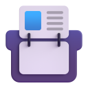

  

  
  
  

 
<h2> 
<b> Organize and Access Your AI Prompts instantly with Promptly. </b>
 </h2>

# 🛡️ What is Promptly?

**Promptly** is a personal, beautifully designed browser extension that lets you save, organize, and quickly copy/insert AI prompts from a clean popup UI. Compatible with both Chrome and Firefox, it works offline using local browser storage, keeping your prompt library accessible, searchable, and always ready.

***

# 🌟 Key Features
- **Modern Glassmorphic UI**: High-fidelity frosted glass appearance with animated gradient backgrounds, powered by **Lucide Icons** for a crisp, professional look.
- **Community Library**: Browse and import curated prompts directly into your personal collection with one click.
- **Smart Sharing**: Generate permanent, client-side sharing links via `ken.tools` that allow others to import your prompts instantly.
- **Search & Filter Flow**: Find prompts quickly by title or tag using the custom search bar and folder organization.
- **One-Click Copy**: Simply click a prompt to copy it. Supports **{{variables}}** for dynamic template filling before copying.
- **Data Portability**: Full Export and Import functionality allows you to backup you prompts as `.json` or sync them across devices.
- **Privacy First**: Fully local operation using `browser.storage.local`. All sharing is client-side; no data is stored on external servers.
- **Cross-Browser Core**: Uses `webextension-polyfill` over Manifest V3 ensuring uniform compatibility between Chrome (`chrome.*`) and Firefox (`browser.*`).

# 📋 Usage Instructions

1. **Install the Extension**: Install Promptly by following the "Get Started" manual loading instructions below.
2. **Setup your Library**: Click the `+` button in the top right of the popup to start writing and saving your custom AI prompts and tags.
3. **Copy to Clipboard**: Whenever you need a prompt, open Promptly and click your desired item. It will immediately copy to your active clipboard!

# 🔒 Why Choose Promptly?

- **Up-to-date Styling**: Built using Vanilla CSS featuring custom backdrops, responsive animations, and auto Dark Mode.
- **Clean User Interface**: Simple, non-intrusive design to help you stay organized without cluttering your browser bar.
- **Free and Open Source**: Available on GitHub, fully customizable and open to community contributions.

# 🚀 Get Started

To start using Promptly, load it manually into your browser:

### 🦊 Firefox
1. Open Firefox and navigate to `about:debugging#/runtime/this-firefox`
2. Click the **Load Temporary Add-on...** button
3. Select the `manifest.json` file inside the `extension/` folder

### 🌐 Google Chrome
1. Open Chrome and navigate to `chrome://extensions/`
2. Enable **Developer mode** in the top right corner
3. Click the **Load unpacked** button
4. Select the inner `extension/` folder from this directory

# 💬 Support & Contributions

For questions or support, feel free to open an issue on the GitHub repository. If you'd like to contribute, just submit a Pull Request!

# 🌐 Quick Links
- [Contribute on GitHub](https://github.com/kenhendricks00/Promptly/pulls)

# 📜 Credits
- [Kenneth Hendricks](https://github.com/kenhendricks00), creator and developer of the Promptly Browser Extension
